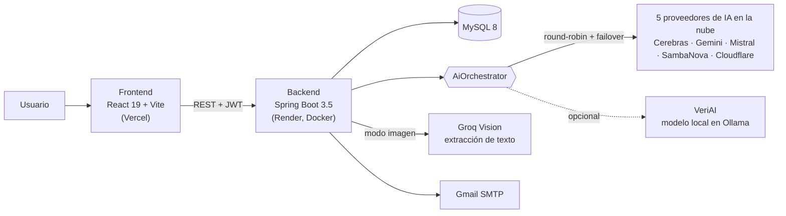

# toVeriAI

**Análisis de credibilidad de noticias con inteligencia artificial.**
Pegas un texto, una URL o una imagen de una noticia y toVeriAI devuelve un índice de credibilidad de 0 a 100 desglosado por dimensiones, con las alertas que explican cada puntuación.

Trabajo de Fin de Ciclo del CFGS en Desarrollo de Aplicaciones Web (IES Fernando Wirtz Suárez) y proyecto personal, hoy en producción.
Autora: **Raquel Comesaña Carrera**, desarrolladora full stack.

> **Sobre este repositorio:** el código fuente es privado. Aquí están la descripción del proyecto, la arquitectura y la [documentación técnica completa](Documentacion/documentacion-tecnica.html). Si quieres ver el código, escríbeme y te lo enseño.

---

## Qué hace

- **Tres modos de entrada:** texto, URL (extrae el artículo y los datos del medio) e imagen (lee el texto de una captura).
- **Índice IMI de 0 a 100**, calculado a partir de 7 dimensiones en modo texto y hasta 9 en modo URL.
- **Explicación, no veredicto:** cada dimensión muestra sus alertas para que el lector entienda por qué sube o baja la nota.
- **Usuarios registrados:** historial, perfil, estadísticas, rachas y exportación del análisis.
- **Multilingüe:** castellano, gallego, catalán y euskera.

## Arquitectura

## Decisiones técnicas destacadas

- **Orquestador de IA con rotación y failover.** El análisis se reparte en round-robin entre cinco proveedores. Si uno falla o llega a su límite, pasa al siguiente, así que la app sigue funcionando aunque caiga un proveedor.
- **Un modelo propio: VeriAI.** Cada análisis en la nube se guarda junto a la respuesta de un modelo local (Ollama), lo que forma un dataset de entrenamiento. Un panel de administración compara los dos y mide la divergencia, que es la base para afinar un modelo que funcione sin depender de APIs externas.
- **Caché por hash de contenido.** Antes de llamar a la IA se calcula el SHA-256 del contenido. Si ya se analizó, se devuelve el resultado guardado; si el medio editó el artículo, el hash cambia y se vuelve a analizar. El cupo diario del usuario solo se descuenta si hubo una llamada real a la IA.
- **Cupos por tipo de usuario:** usuarios anónimos, registrados y premium, con bonus por racha de uso.
- **Seguridad:** Spring Security con JWT, roles (USER, PREMIUM, ADMIN) y credenciales solo en variables de entorno.
- **API documentada** con Springdoc OpenAPI (Swagger UI).
- **Despliegue continuo:** cada push a `main` despliega el frontend en Vercel y el backend en Render.

## Índice IMI

Las ponderaciones parten del marco NewsGuard y se completan con criterios de la IFCN y The Trust Project.

| Dimensión            | Peso |
|----------------------|------|
| Verificación factual | 26 % |
| Consistencia interna | 24 % |
| Fuentes              | 15 % |
| Sesgo                | 12 % |
| Tono general         | 12 % |
| Semántica            | 6 %  |
| Cifras               | 5 %  |

Cada dimensión recibe entre 0 y 5 alertas y la nota final penaliza según el peso de cada una. En modo URL se añaden **Transparencia del medio** y **Autoría**.

## Stack

| Capa | Tecnologías |
|------|-------------|
| Backend | Java 17, Spring Boot 3.5, Spring Security + JWT (JJWT), Spring Data JPA / Hibernate, Spring Mail, JSoup, Lombok, Springdoc OpenAPI |
| Frontend | React 19, Vite, React Router, Axios, Recharts, UnoCSS, i18n propio |
| Datos | MySQL 8 |
| IA | Cerebras, Gemini, Mistral, SambaNova y Cloudflare en rotación; Groq Vision; Ollama |
| Infraestructura | Vercel, Render (Docker), Gmail SMTP |

## Contacto

- Portfolio: <https://raquelccarreraa.github.io/Portfolio-raquelcarerra/>
- LinkedIn: [Raquel Comesaña Carrera](https://www.linkedin.com/in/raquel-comesa%C3%B1a-carrera-1646ba195)
- Email: raquel.ccarrera@gmail.com
