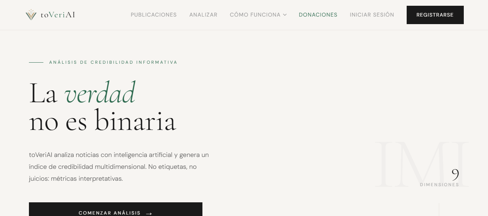
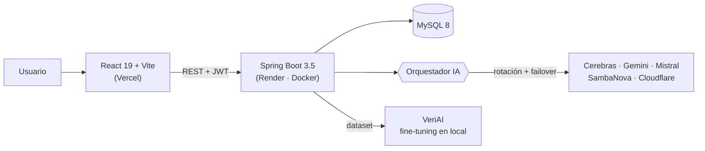

# toVeriAI

**La IA que te dice cuánto puedes fiarte de una noticia, y por qué.**

[**▶ Pruébala en toveriai.com**](https://www.toveriai.com)

Pegas un texto, una URL o una captura de una noticia y, en menos de 30 segundos, toVeriAI devuelve un **índice de credibilidad de 0 a 100** con la explicación de cada nota y citas literales del artículo. Sin cajas negras.

Es mi proyecto: la creé desde cero y la sigo evolucionando como un producto **en producción**.

| 9 | 3 | 5 | 5 | v2 |
|:---:|:---:|:---:|:---:|:---:|
| dimensiones de análisis | modos: texto, URL e imagen | proveedores de IA en rotación | idiomas | de mi propio modelo de IA |

---

## Lo más destacado

**🧠 Mi propio modelo de IA: VeriAI.**
Cada análisis en producción alimenta un dataset de entrenamiento. Lo exporto, hago fine-tuning en local y cada 6.000 análisis sale una versión nueva: va por la **v2 (Qwen 2.5 7B)**, con una variante sobre **Qwen 3.5 7B** en marcha. Pasará a producción cuando iguale o supere a las APIs comerciales.

**⚡ Cinco LLMs que nunca la dejan caer.**
Un orquestador propio reparte el trabajo entre **Cerebras, Gemini, Mistral, SambaNova y Cloudflare**, con failover automático. Elijo los proveedores con datos: Groq quedó fuera de la puntuación porque, en pruebas con noticias falsas, detectaba peor que el resto.

**🔍 Explicable, no un veredicto.**
El Índice de Métricas Interpretativas (IMI) se basa en los criterios de NewsGuard, IFCN y The Trust Project. Puntúa la verificación factual, las fuentes, el sesgo o el tono, y cada nota viene con citas del artículo.

**👥 Más que una herramienta: una comunidad.**
Feed público donde los usuarios votan si coinciden con la IA, ranking de fiabilidad de los medios, avisos cuando un medio que sigues cambia, rachas con recompensa e informe PDF Premium.

## Qué demuestra este proyecto

- **Full stack de verdad:** API REST con Spring Boot y frontend en React, del modelo de datos al despliegue.
- **IA aplicada:** integración de varios LLMs, ingeniería de prompts, generación de datasets y fine-tuning.
- **Pensar en producción:** caché por hash para no gastar llamadas, cupos por usuario, tareas programadas y despliegue continuo en Vercel y Render con Docker.
- **Seguridad:** Spring Security con JWT, roles, login con Google y verificación por email.
- **Calidad:** tests con JUnit, API documentada con Swagger y colección de Postman.
- **Producto:** interfaz en 5 idiomas, panel de administración completo y modelo freemium.

## Arquitectura

**Stack:** Java 17 · Spring Boot · Spring Security · JWT · JPA/Hibernate · MySQL · React 19 · Vite · Recharts · jsPDF · Docker · Ollama · Qwen · JUnit

---

El código es privado, pero te lo enseño encantada en una entrevista. Si quieres más detalle técnico, aquí está la [documentación técnica](Documentacion/documentacion-tecnica.html).

## Sobre mí

Soy **Raquel Comesaña Carrera**, desarrolladora full stack (Java · Spring Boot · React) en A Coruña, especializándome en IA y Big Data. **Busco trabajo como desarrolladora, con disponibilidad inmediata.**

[Portfolio](https://raquelccarreraa.github.io/Porfolio-raquelcarrera/) · [LinkedIn](https://www.linkedin.com/in/raquel-comesa%C3%B1a-carrera-1646ba195) · raquel.ccarrera@gmail.com
